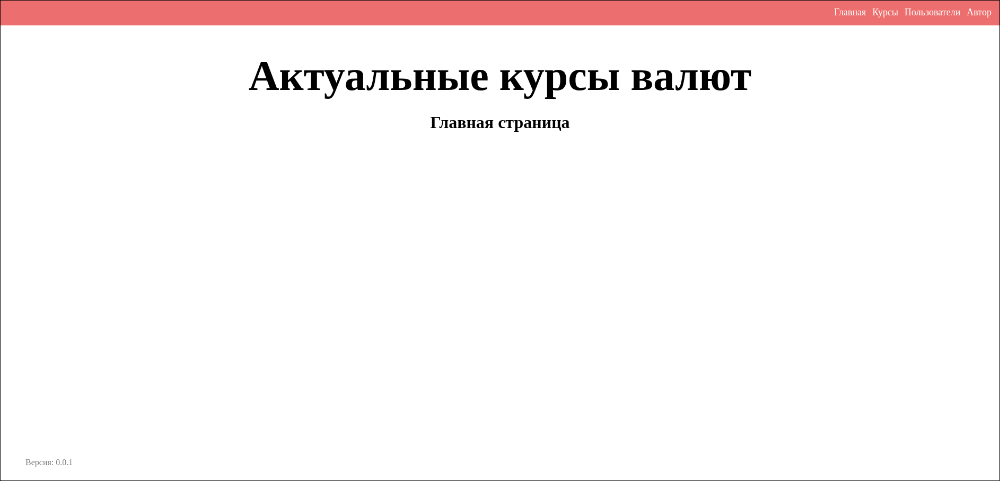
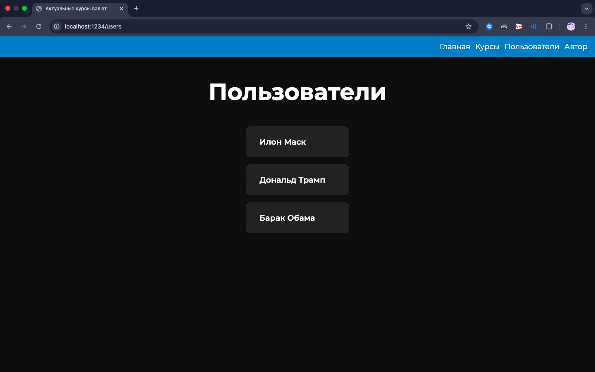
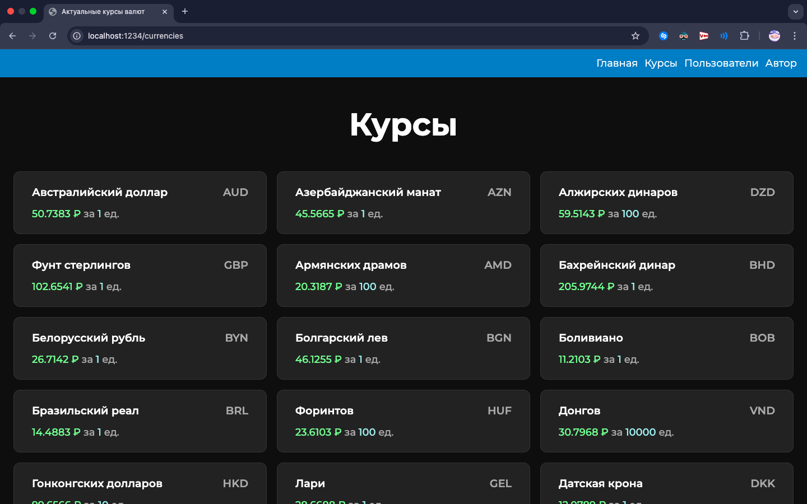
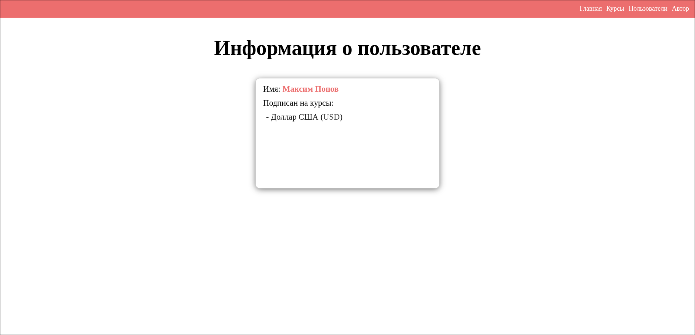
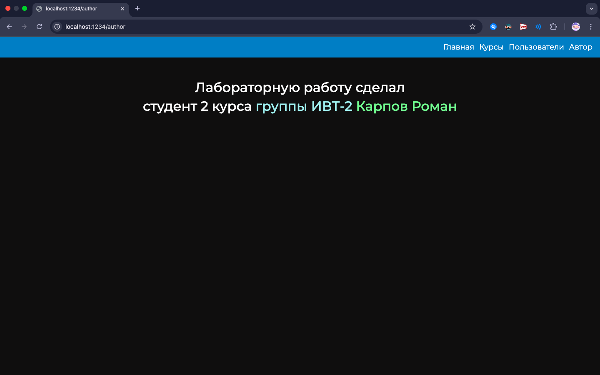

# Лабораторная работа №7. Создать простое клиент-серверное приложение на Python.

## Цель работы

1. Создать простой HTTP сервер на Python без использования серверных фреймворков.
2. Освоить работу с HTTPServer и маршрутизацию запросов.
3. Применять шаблонизатор Jinja2 для отображения данных.
4. Реализовать модели предметной области (`User`, `Currency`, `UserCurrency`, `App`, `Author`) с геттерами и сеттерами.
5. Структурировать код в соответствии с архитектурой MVC.
6. Получать данные о курсах валют через функцию `get_currencies` и отображать их пользователям.
7. Реализовать функциональность подписки пользователей на валюты и отображение динамики их изменения.
8. Научиться создавать тесты для моделей и серверной логики.

## Описание предметной области

### Модели

1. Author
   * `name` — имя автора
   * `group` — учебная группа
2. App
   * `name` — название приложения
   * `version` — версия приложения
   * `author` — объект Author
3. User
   * `id` — уникальный идентификатор
   * `name` — имя пользователя
4. Currency
   * `id` — уникальный идентификатор
   * `num_code` — цифровой код
   * `char_code` — символьный код
   * `name` — название валюты
   * `value` — курс
   * `nominal` — номинал (за сколько единиц валюты указан курс)

5. UserCurrency
   * `id` — уникальный идентификатор
   * `user_id` — внешний ключ к User
   * `currency_id` — внешний ключ к Currency
   * Реализует связь «много ко многим» между пользователями и валютами

## Архитектура проекта (MVC)

Структура папок:

```
Lab7/
├── models/
│ ├── __init__.py
│ ├── author.py
│ ├── app.py
│ ├── currency.py
│ ├── user_currency.py
│ └── user.py
├── templates/
│ ├── index.html
│ ├── users.html
│ └── currencies.html
├── static/
│ └── css, js, изображения
├── main.py
└── utils/
 └── currencies_api.py # функция get_currencies
```

## Описание реализации

* Реализовны модели `Author`, `App`, `Currency`, `User`, `UserCurrency` с геттерами и сеттерами.
* Реализована маршрутизация - проверяем значение свойства `path` у `HttpHandler` и отправляем соответствующую сгенерированную html-страницу, если значение неправильное - отправляем ошибку 404.
* Для генерирования html-страниц используется шаблонизатор jinja2.
* Для получения курс валют используется функция `get_currencies` из предыдущей ЛР.

## Скриншоты

### Главная страница (`/`)



### Страница с пользователями (`/users`)



### Страница с курсами валют (`/currencies`)



### Страница с информацией о пользователе (`/user?id=...`)



### Страница с информацией об авторе (`/author`)



## Тестирование 

Будет сделано...

## Выводы

Узнал о библиотеке jinja2, о том как работает HTTP сервер, а также научился применять принцип MVC.
