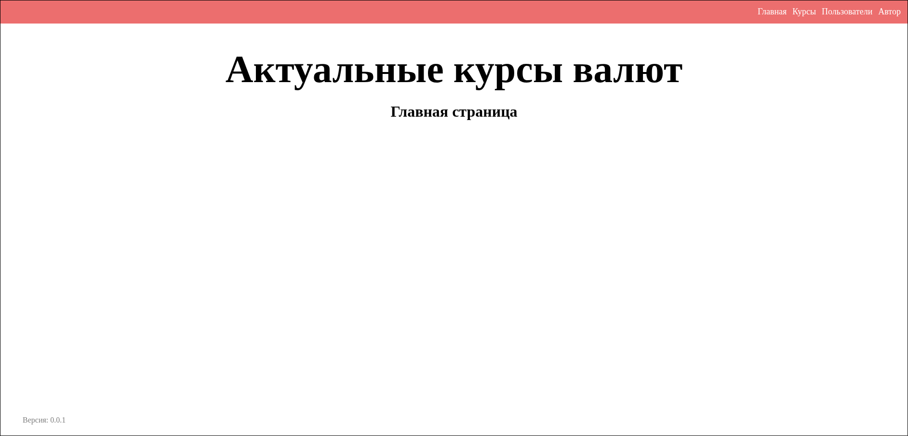
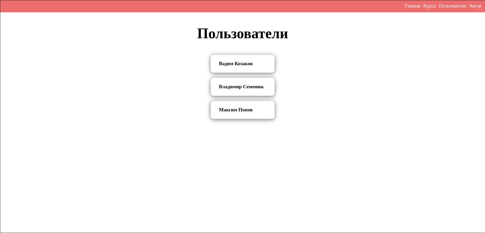
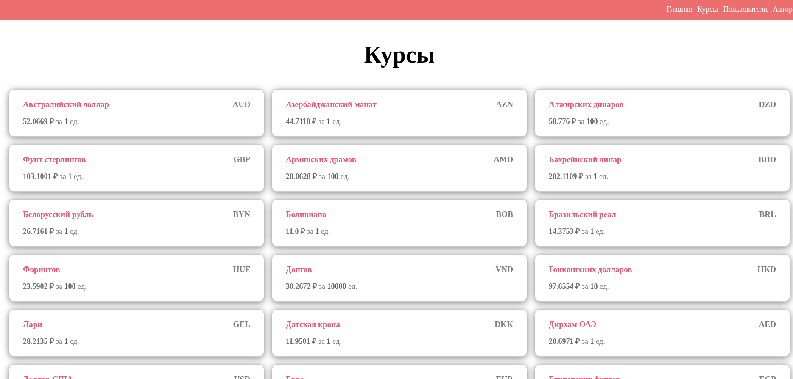
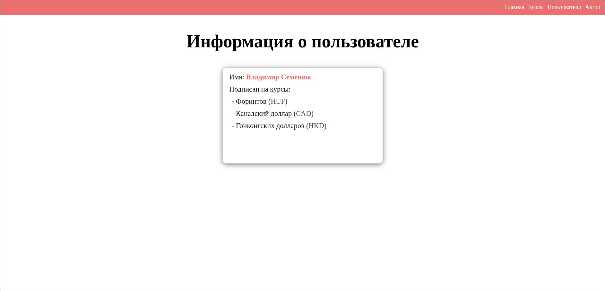
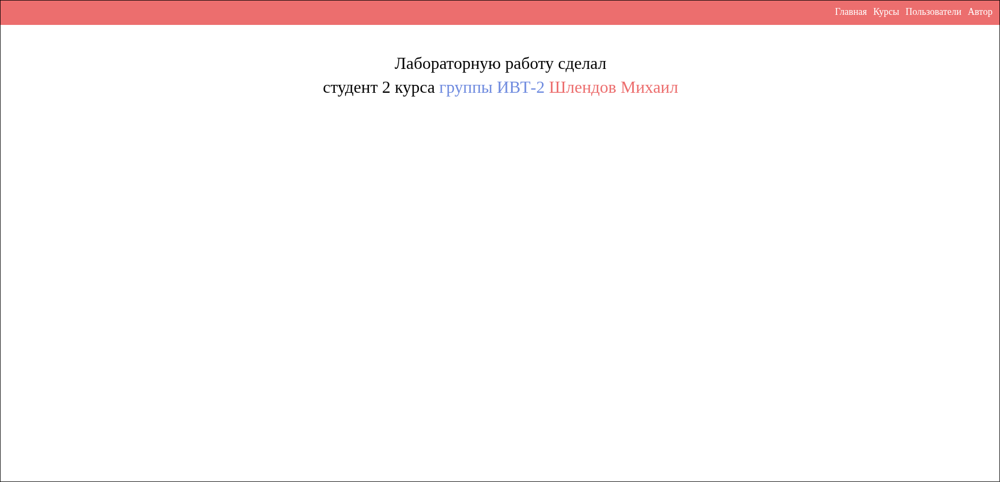

# Лабораторная работа 8

## Цель работы

1. Реализовать CRUD (Create, Read, Update, Delete) для сущностей бизнес-логики приложения.
2. Освоить работу с SQLite в памяти (`:memory:`) через модуль `sqlite3`.
3. Понять принципы первичных и внешних ключей и их роль в связях между таблицами.
4. Выделить контроллеры для работы с БД и для рендеринга страниц в отдельные модули.
5. Использовать архитектуру MVC и соблюдать разделение ответственности.
6. Отображать пользователям таблицу с валютами, на которые они подписаны.
7. Реализовать полноценный роутер, который обрабатывает GET-запросы и выполняет сохранение/обновление данных и рендеринг страниц.
8. Научиться тестировать функционал на примере сущностей currency и user с использованием unittest.mock.

## Основные задачи

1. **CRUD для Currency**
   * `Create` — добавление новых валют в базу данных.
   * `Read` — вывод валют из базы данных.
   * `Update` — обновление значения курса валюты.
   * `Delete` — удаление валюты по id.
   * Все действия должны использовать **параметризованные запросы для защиты** от SQL-инъекций.

2. **Работа с SQLite**
   * Использовать базу в памяти (`sqlite3.connect(':memory:')`).
   * Объяснить, для чего нужны первичные ключи (`PRIMARY KEY`) и внешние ключи (`FOREIGN KEY`).

## Скриншоты

### Главная страница (`/`)



### Страница с пользователями (`/users`)



### Страница с курсами валют (`/currencies`)



### Страница с информацией о пользователе (`/user?id=...`)



### Страница с информацией об авторе (`/author`)



## Тестирование

Вывод:

1. `test_get_currencies` -- Тестирование функции `get_currencies` при правильных ID.
2. `test_get_currencies_wrong_id` -- Тестирование функции `get_currencies` при неправильном ID.
3. `test_author_controller` -- Тестирование `AuthorController`.
4. `test_currencies_controller` -- Тестирование `CurrenciesController`.
5. `test_users_controller` -- Тестирование `UsersController`.

```shell
.....
----------------------------------------------------------------------
Ran 5 tests in 0.197s

OK
```

## Выводы

Узнал как работать с SQLite, о том как работает HTTP сервер, а также научился применять принцип MVC.